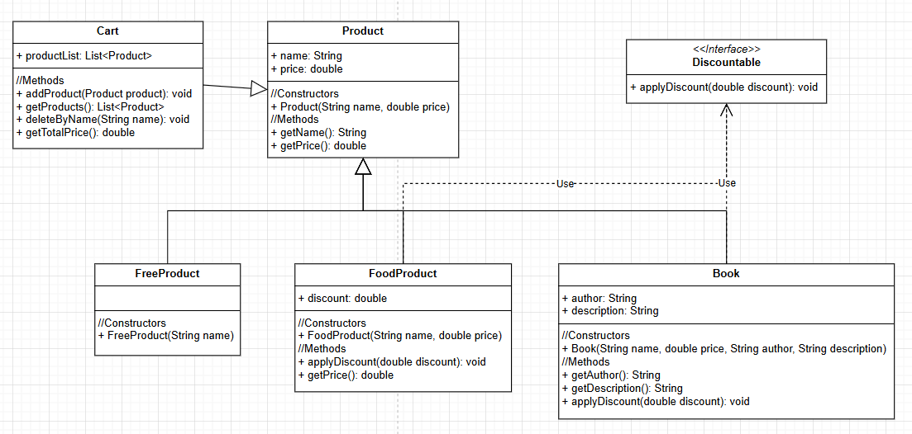

# 🛒 Shopping Kata

### 🎥 Objetivos

El objetivo de esta kata es practicar los principios básicos de la OOP como: Abstración, Encapsulación, Herencia, Polimorfismo e Interfases usando TDD.


### ⚙️ Requisitos

Hay que usar TDD. Recuerda:

<aside>
🚧 **Test → Red → Green → Refactor 🔁**

</aside>

- No puedes escribir código sin un test que falle
- No puedes escribir nuevos tests que no fallen.
- Escribe siempre la solución más sencilla que haga pasar los tests. Refactoriza después.

### ⚙️ Requisitos Funcionales

- **Ejemplo: el precio de los productos gratuitos (`FreeProduct`) es siempre cero**

    ```java
    @Test
    void elPrecioDeLosProductosGratuitosEsSiempreCero() {
        FreeProduct freeProduct = new FreeProduct("perejil");
        assertEqual(0.0, freeProduct.getPrice());
    
    }
    ```


- Todos los productos tienen **nombre y precio**
- A los productos de alimentación (`FoodProduct`) se les puede añadir un descuento (%):
    - El precio de un producto sin descuento es el precio original del producto
    - El precio de un producto con descuento es el precio original con el descuento del % asignado
- Al carro de la compra `Cart` se le pueden añadir productos uno a uno (pero no puede tener dos productos repetidos).
- Podemos consultar la lista de productos añadidos al carrito.
- El carrito permite eliminar un producto por su nombre.
- El carro de la compra `Cart` contiene un número de productos (puede ser cero).
- El coste total del carro es la suma de los precios de los productos aplicando los descuentos.
- Los productos de tipo `Book` tienen un autor y una descripción (además de nombre y precio) y se les puede añadir un descuento pero no mayor del 10%.

### ✓ Preguntas de análisis

- ¿ Qué tipo de relación existe entre los productos y el carrito ?
- ¿ Qué tipo de relación existe entre los productos de diferentes tipos ?
- ¿ Qué técnicas utilizas para aplicar el descuento a los productos ?
- Realizar un diagrama de clases UML de la kata.

### 🗝 UML

- El siguiente diagrama UML muestra las relaciones entre las clases `Product`, `FoodProduct`, `FreeProducto`, `Book` y `Cart`.


  UML: Diagrama de Clases


> Paginas recomendadas
>
- [https://kata-log.rocks/](https://kata-log.rocks/fizz-buzz-kata)
- https://www.codewars.com/
- https://codingdojo.org/kata/